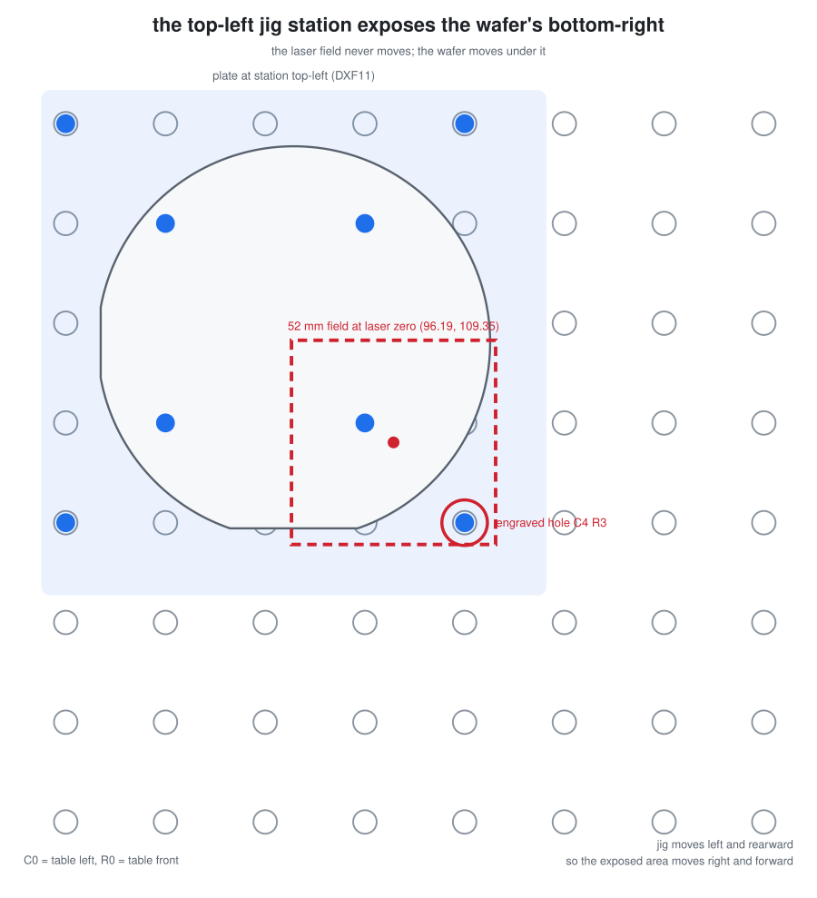
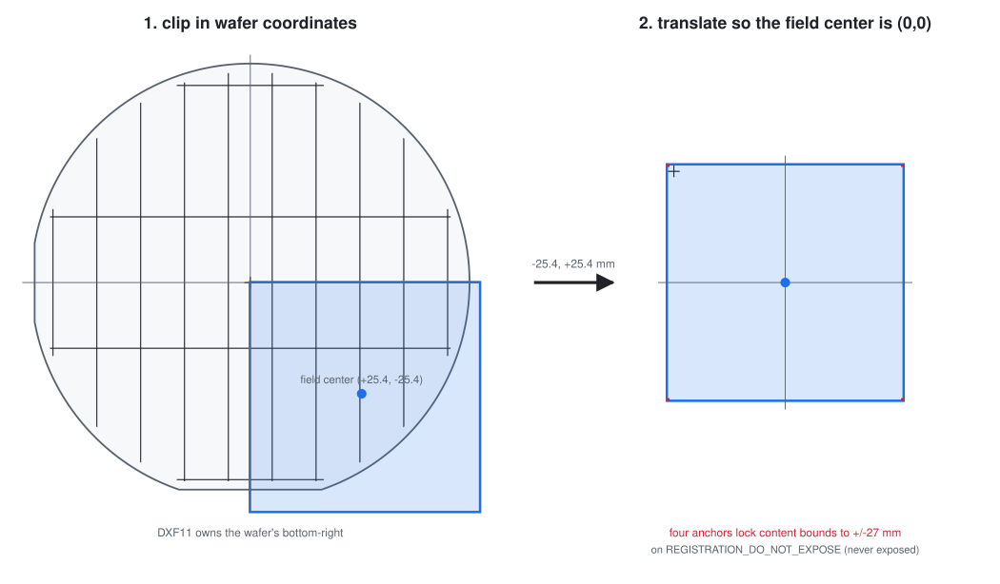
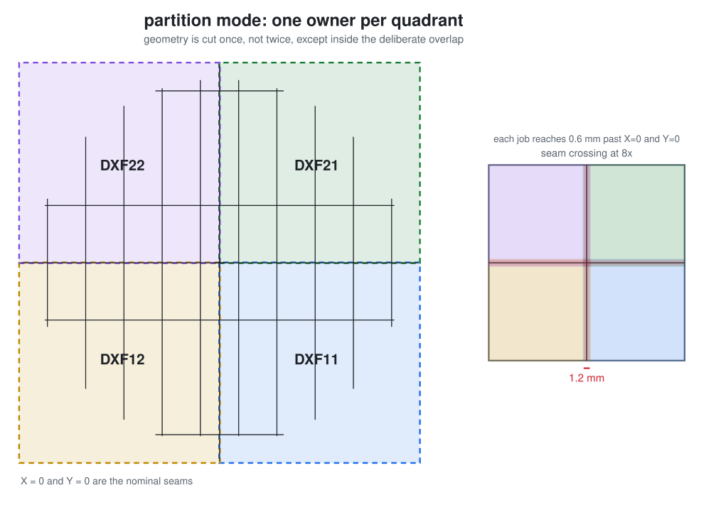
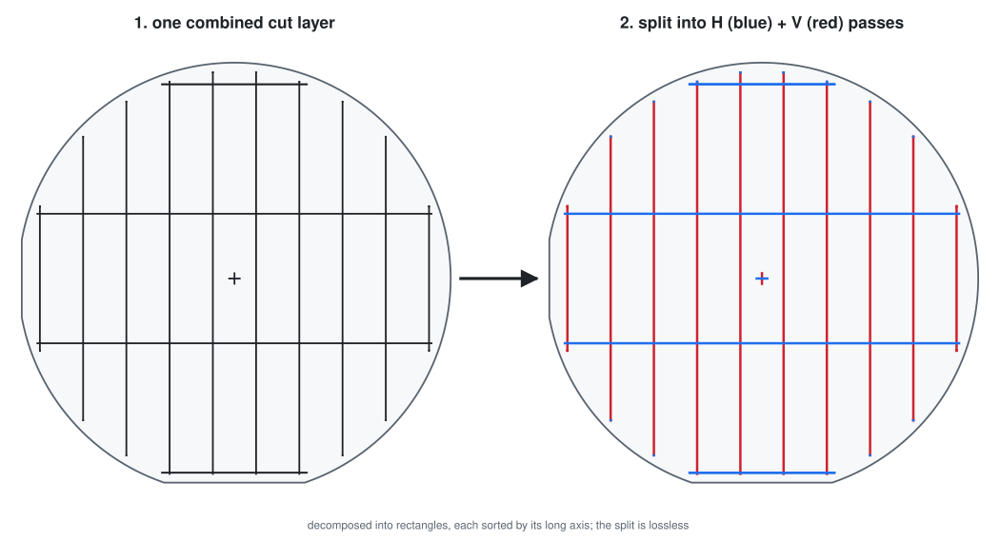

# Documentation

How the toolchain fits together, what the labels mean, and what the laser must be
told before a file is exposed. For the measurement history and why the design
ended up this way, see
[CALIBRATION_AND_SLIDING_NEST_NOTES.md](CALIBRATION_AND_SLIDING_NEST_NOTES.md).

## Contents

- [Scope and safety](#scope-and-safety)
- [Requirements](#requirements)
- [The labeling convention](#the-labeling-convention)
- [Pipeline](#pipeline)
- [Slicing an arbitrary pattern](#slicing-an-arbitrary-pattern)
- [Double exposure](#double-exposure)
- [Laser import settings](#laser-import-settings)
- [Jigs and printing](#jigs-and-printing)
- [Running the KLayout macros directly](#running-the-klayout-macros-directly)
- [Reference](#reference)

## Scope and safety

### What this repository is

Geometry generation and the fixtures that position a wafer. It produces DXF files
whose coordinates are correct with respect to one measured machine, and STLs for
jigs that index that wafer on a 1 inch table grid.

### What it is not

It specifies **no laser system and no process parameters**: no make or model, no
wavelength, no average or peak power, no laser class, no pulse energy, repetition
rate, scan speed, pass count, focus height, or assist gas. Nothing here has been
validated as a process. The only exposure statement in the whole repository is
geometric: cut features are `50 um` wide.

Consequently:

- **Laser eyewear must match your actual wavelength and power.** Generic safety
  glasses are not laser eyewear. UV is invisible, so there is no blink reflex to
  rely on. Work inside your facility's own laser safety controls, enclosure, and
  interlocks, under whatever authority governs that laser.
- **Silicon debris is a real hazard.** Laser-cutting silicon generates respirable
  particulate; fracturing a scored wafer throws sharp fragments. Use extraction
  appropriate to the material and contain the break.
- **"Low power" is deliberately undefined here** because it depends entirely on a
  laser this repository knows nothing about. Establish it empirically on
  sacrificial material, starting below anything you expect to mark.
- **The fracture workflow is an experiment, not a recipe.** Whether a scored wafer
  breaks cleanly depends on score depth, crystal orientation, thickness, coatings,
  and edge defects. Prove it on sacrificial wafers before trusting real material.

### Calibration is machine-specific

`LASER_ZERO = (96.190, 109.350) mm`, the nest offsets, and the field size were
measured by hand on one table with one printed jig, and are treated throughout as
authoritative *for that setup only*. On any other machine they are simply wrong.
Re-measure your own zero before cutting anything you care about, and treat the
numbers here as a worked example of the method rather than values to copy.

The history in
[CALIBRATION_AND_SLIDING_NEST_NOTES.md](CALIBRATION_AND_SLIDING_NEST_NOTES.md)
records one calibration that was already wrong once: an edge-derived field center
of `(100.172, 107.672)` was superseded by a directly measured `(96.190, 109.350)`,
a `1.678 mm` correction in Y.

There is now only one splitter. The old-jig profile that carried a hardcoded
`(-3.982, +1.678) mm` compensation for the original printed jig was removed on
2026-08-08 along with the jig itself; it would have placed geometry wrong on the
current one. It remains in git history if the archived sets ever need rebuilding.

## Requirements

- Python 3.11+ and the standalone KLayout wheel, which is all `slicing/` needs.
  Developed against `klayout` 0.30.9.
- Optionally the KLayout application, to run the macros in `slicing/` from its GUI
  or headless executable instead.
- Autodesk Fusion, only to regenerate the jig CAD and STLs. The scripts in
  `fusion/` use the Fusion API and cannot run outside it.

### Dependency licensing

Worth knowing before choosing a license for this repository:

- **KLayout is GPL-3.0-or-later.** Every script in `slicing/` imports
  its API (`pya`, or `klayout.db` from the wheel); the `laser-pc/` app does not
  (it uses pyserial + pywin32). If you distribute this code
  under a license of your own, look at how that interacts with the GPL before
  assuming a permissive license is available to you.
- **The Autodesk Fusion API is proprietary.** The scripts in `fusion/` import
  `adsk.core` and `adsk.fusion`, which exist only inside Fusion and are governed by
  Autodesk's terms. The `.manifest` files and `.vscode/launch.json` in each jig
  folder are Autodesk-generated add-in scaffolding.

## The labeling convention

This is the thing most likely to cause an expensive mistake.

Folder and job labels name the **jig station**: P1-P4, numbered clockwise from the
table's top-left (P1 top-left, P2 top-right, P3 bottom-right, P4 bottom-left).

Indexing the jig moves the wafer, not the laser. Both axes therefore invert, and
each station exposes the **diagonally opposite** wafer quadrant:

| Folder | Jig station | Engraved hole | Exposure center | Exposes |
| --- | --- | --- | ---: | --- |
| `P1` | top-left | `C1 R4` | `(+25.4, -25.4) mm` | wafer bottom-right |
| `P2` | top-right | `C3 R4` | `(-25.4, -25.4) mm` | wafer bottom-left |
| `P3` | bottom-right | `C3 R2` | `(-25.4, +25.4) mm` | wafer top-left |
| `P4` | bottom-left | `C1 R2` | `(+25.4, +25.4) mm` | wafer top-right |



The laser field is bolted to the table at laser zero. Only the wafer moves, so
sliding the jig left and rearward slides the exposed area right and forward. The
red circle is the one hole the plate engraves for this station.

Grid columns count from the table left and rows from the table front, both from
one. The engraved hole is the outer front-left pin, the one to the left of the
wafer's primary flat. The four-pin pattern is rigid, so seating that single pin
fixes the other three; it always sits two grid spaces left of and two spaces
forward of the pin-pattern center.

Verify all of it from the table geometry rather than trusting this table:

```bash
python slicing/pin_grid_layout.py
```

### The old scheme

Sets generated before 2026-08-08 label folders by **exposed wafer quadrant**,
where `DXF11` means the wafer's top-left. Converting between the schemes swaps
`11` and `22` and leaves `12` and `21` unchanged, name and contents both. Two of
four folders therefore look untouched while meaning something different, so
confirm against the jig station, never the digits alone.

The archived sets under `output/` were deliberately not renumbered, because the
recorded seam measurements name those folders.

## Pipeline

```
dxf/100mm_10x30mm_Masters/          slicing/generate_100mm_10x30mm_masters.py
  Horizontal_master.dxf                 50 um cuts on a 10 x 30 mm grid, clipped
  Vertical_master.dxf                   2 mm inside the edge and both flats
        |
        |  slicing/split_klayout.py
        |  driven by slicing/build_pin_grid_set.py
        v
output/DXFs/<set>/P1..P4/           four 51 mm windows in a 54 mm declared field,
  Horizontal.dxf  Vertical.dxf       each centered on (0,0), 0.2 mm stitch overlap
```

Horizontal and vertical cuts are separate files for the same jig position. Run
both without moving the jig or the wafer between them.

### Clip, then translate



The splitter intersects the master with one clip box per station, then translates
the result by the negative of that station's field center. Every output therefore
sits centered on `(0, 0)`, which is what the laser expects: run with auto-centering
off, it places each job at its true coordinates, so the DXF origin lands on the
field center and the wafer is reproduced exactly.

### Partition mode and the seam



`partition` mode, the default, gives each quadrant a single owner so geometry is
cut once rather than twice, then extends each job `0.600 mm` past `X=0` and `Y=0`
so neighbours meet instead of leaving a gap. The zoom shows the only region where
two jobs deliberately overlap.

`CLIP_MODE` matters at the production settings. `partition` gives each quadrant
one owner and adds the stitch, so a window is `51 mm`. `full_window` takes the whole
`54 mm` declared field instead, overlapping neighbours by `3.2 mm` and exposing that
entire band twice.

### Guarantees the splitter enforces

Three checks run on every build, so a square origin-centred window does not
depend on anyone remembering the relationship between the settings:

1. **The window fits the field.** A partition window spans
   `2 x WINDOW_CENTER + STITCH_OVERLAP_UM`, set by the jig's two-grid-space move
   and the stitch. The declared field must be at least that wide or geometry would
   fall outside the window the laser is told to expose; at `54 mm` the stitch may go
   up to `3.2 mm`. Both window centers must also match.
2. **Every window is square.** Each clip box is checked to be square, of the
   expected size, symmetric about its own field center after translation, and
   inside the declared field.
3. **Nothing is silently discarded.** Geometry outside all four windows is
   measured before clipping and stops the run, reporting the lost area and its
   bounds. A pattern reaching `+/-70 mm` loses `148.8 mm2`, `26.8%` of the cut
   geometry, and without this check produced four healthy-looking square files
   and a zero exit code. Pass `-rd allow_geometry_outside_fields=1` when clipping
   the pattern away really is intended.

The split log records all three, including the source and dropped areas.

### Field and stitch geometry

- Declared field: `54.000 x 54.000 mm`, the qualified field the windows sit inside.
- Window occupied per job: `51.000 mm`, its own half of the pitch plus the stitch,
  centred in the field with `1.500 mm` clear on every side.
- Field centers on the wafer: `X,Y = +/-25.400 mm`.
- Physical move between neighboring stations: `50.800 mm`, two 1 inch grid spaces.
- Total stitch overlap: `0.200 mm`, so each job extends `0.100 mm` across the
  nominal `X=0` and `Y=0` seams. That covers the `75-100 um` seam mismatch the
  calibration notes measured.
- Margin from the 54 mm window to every edge of the `60 mm` usable field: `3 mm`.
  The galvo's full field is about `78.485 mm`, but it weakens toward the edges, so
  only the central `60 mm` is used.
- Dice pitch `10.000 mm` in X, `30.000 mm` in Y. Cut width `50 um`.
- Edge bead / exclusion `2.000 mm`, applied inward from the circular edge and
  both flats, from the single `EDGE_BEAD_MM` variable in the master generator.

### Validation

`slicing/validate_pin_grid_set.py` runs two independent checks and exits non-zero if
either fails:

1. **Reconstruction.** Each tile is translated back by its own field center and
   unioned. The result must XOR to exactly zero area against the layer-0 master,
   proving no cut geometry was lost, duplicated, or shifted by the split.
2. **Field placement.** A self-test with the origin at the field center: every
   tile's layer-0 geometry must fit within `+/-30 mm` of the origin, the usable
   field half. It also reports how far a job would be misplaced if auto-centering
   were left on.

## Laser import settings

Layer `0` is the only cutting layer.

Placement relies on **true coordinates**. Run the laser (WinLase Pro) with
auto-centering **off**, so it places each job at its true coordinates and the DXF
origin lands on the field center. The splitter already writes every tile with its
field center at the DXF origin, so this reproduces the wafer exactly. This was
confirmed empirically on the machine with a placement probe.

**Turn auto-centering off. Never use fit-to-field scaling. Import at the drawing
origin.**

This is not theoretical. A full-wafer run displaced one horizontal pass by about
`8 mm` because the importer auto-centered each file on its content bounds, and one
file's bounds were skewed by the centered alignment marker. The splitter math was
correct; the placement was not. With cutting geometry alone, `DXF12` and `DXF22`
of that failed set have bounding-box centers `8.1125 mm` apart in Y, which is what
landed on the wafer. Placing each job at its true coordinates instead makes
per-file centering irrelevant.

## Jigs and printing

| Script | Jig |
| --- | --- |
| [`fusion/FusionPinGridJig`](fusion/FusionPinGridJig) | Four-position four-pin grid jig; P0 also centers the wafer. Current. |
| [`fusion/FusionSingleJig`](fusion/FusionSingleJig) | Earlier single-position indexer. |

The pin-grid jig is one physical plate, moved between table-hole positions: the four
stations `P1`-`P4` and the centered `P0`. It has **four** locating pins on the corners of
a `101.600 mm` square, and a pickup tab centered on the left and right edges:
`10 mm` out by `24 mm` long, spanning z `2` to `6 mm` so there is a `2 mm` undercut
to hook under when lifting the plate off its pins. The base is `3 mm` thick. It carries
**four** raised `0.500 mm` engravings: the title `ALIGNER` and the centering position
`P0` at top-left; the `P1`-`P4` station map (one hole per station) at top-right;
`ALIGNMENT PIN` at front-left, naming the outer pin nearest that corner, which is the
pin every engraved coordinate refers to; and `C1=LEFT R1=FRONT` at front-right, so the
counting convention survives at the machine.

To regenerate a jig: open Fusion, press **Shift+S**, on the Scripts tab click
**+** and select the script's folder, then Run. Each script writes its `.f3d` and
`.step` beside itself and a high-quality binary `.stl` into
[`fusion/print-files`](fusion/print-files).

Sliceable STLs are already committed. Print the pin-grid jigs with the 2 mm wafer
platform upward; the downward pins need support blockers everywhere except beneath
the pins. Verify pin fit on a coupon first: nominal radial clearance is `0.110 mm`
against a measured `4.870 mm` thread minor diameter, and PLA shrinkage and thread
crests both matter at that scale.

## Slicing an arbitrary pattern

The production path (`slicing/build_pin_grid_set.py`) is wired to the 100 mm masters.
To slice something else, pick which layer holds the cutlines and what width they
should be.

### One combined cut layer

The production build takes two pre-separated masters, one horizontal and one
vertical. When a source instead carries both orientations on a single layer — as
customer layouts often do, drawn as connected street networks or die-outline
frames — `build_pin_grid_set.py` can split it in one step:

```bash
python slicing/build_pin_grid_set.py --combined wafer.gds --cut-layer 7 --set output/DXFs/MySet
```

It reads the cut layer, decomposes it into axis-aligned rectangles, and sorts each
by its long axis into a horizontal pass and a vertical pass; crossing junctions
join both passes so no cut line is broken. The split is lossless — `H | V`
reconstructs the layer exactly — and it aborts if the layer is not purely
axis-aligned (author those cuts on two layers and use `--masters` instead).
`--cut-layer` takes a GDS number like `7` or `7/0`, and `--edge-bead <mm>` insets
the cuts from the wafer edge first. Validate the result with the `--master-stem`
the build prints.



### Desktop window

```bash
python slicing/slicer_app.py
```

PySide6 + QML, using Qt's own `FluentWinUI3` style pinned to dark.

```bash
pip install PySide6
```

**On Windows, enable long paths first.** The PySide6 wheel's deepest file sits about
142 characters below `site-packages`, which overruns the legacy 260 character limit
on any interpreter whose `site-packages` path is already long — the Windows Store
Python's is 138. The install then fails partway and leaves a tree that looks
installed but has **no QML modules at all**, so every `import QtQuick.Controls`
fails with `plugin "qtquickcontrols2plugin" not found`. Fix it once, from an
administrator shell:

```bash
reg add "HKLM\SYSTEM\CurrentControlSet\Control\FileSystem" /v LongPathsEnabled /t REG_DWORD /d 1 /f
```

New processes pick it up; reinstall PySide6 afterwards with `--force-reinstall` if a
partial tree was already left behind.

If you would rather not touch the registry, a venv at a short path such as
`C:/Users/<you>/venvs/uvlaser` keeps every path inside the limit and works without
admin rights.

Choose a file and it reads the layers out of it, showing shape counts, drawn area,
and existing path widths for each. It preselects the layer with the most drawn area,
which is the cutline layer in every file this toolchain has seen, but any layer can
be chosen by name or by number.

Width has two modes. **Cap** narrows only paths wider than your value and leaves
thinner ones alone; **force** sets every path to exactly your value, widening as
well as narrowing. The window says so explicitly when the chosen layer holds filled
polygons, because those carry their size as geometry and no width setting can change
them — the generated 100 mm masters are polygons for exactly that reason.

The preview has two views. **Wafer** draws the source with the four windows over it,
the seam cross, the wafer outline, and the edge-bead ring when one is set, as a
guide. **Sliced jobs** draws
the four outputs as the laser will see them, each centred on its own origin. Both are
computed by calling the splitter's own clip and layer functions, so the preview cannot
drift from what a run writes.

**Alignment**, pinned at the bottom left, tunes placement without editing code: one
offset for all four jobs, and a per-station nudge on top of it. It moves the cut
geometry relative to the field center.

**Wafer edge bead**, entered in millimetres, insets the cut geometry from the wafer
edge before slicing — the same safe region the master generator uses — and the
dashed guide ring follows the value entered. `0` leaves the geometry untouched.

**Datasets** are named settings, kept in `slicing/.ui_datasets.json` as
`{name: {settings}}`. Save, reload and delete them from the header.

### Command line

The same options without the window:

```bash
python slicing/run_splitter.py --input wafer.dxf --list-layers
```

```bash
python slicing/run_splitter.py --input wafer.dxf --layer CUT --cut-width 40 --width-mode force --output jobs/
```

Add `--allow-outside`, `--global-x/--global-y`,
`--clip-mode`, `--stitch`, `--edge-bead`, or `--extension` as needed. This is also the supported way
to drive the splitter from plain Python, since the macro itself reads overrides from
`globals()` and parses no arguments of its own.

## Double exposure

Two places in the current recipe expose the same area twice. Measured on the
production set:

| source | area at 2x dose | share of exposed area |
| --- | ---: | ---: |
| grid crossings, where `Horizontal.dxf` meets `Vertical.dxf` | `0.0700 mm2` in 28 spots of `50 x 50 um` | `0.14%` |
| seam overlap, where two neighbouring jobs both reach past `X=0` / `Y=0` | `0.4225 mm2` | `0.86%` |
| total | `0.4925 mm2` of `49.1333 mm2` | `1.00%` |

The **seam overlap is deliberate** — it is the `0.2 mm` stitch that stops a gap
appearing at the seam — and it is still the larger contributor. The **crossings are
incidental**: they land exactly on the corners of every die, which is where chipping
starts, so if corner quality matters they are worth removing.

Scoring partway through rather than cutting is what makes a small double-dosed band
acceptable. At the previous `1.2 mm` stitch the total was `1.3925 mm2`, `2.83%`.

Removing them needs no change to what gets cut. Emitting `Vertical - Horizontal`
instead of `Vertical` leaves the union bit-identical (verified: XOR area zero) while
dropping crossing overlap to zero, at the cost of `0.0700 mm2` less vertical
geometry. Not implemented; raise it if you want it.

## Running the KLayout macros directly

The KLayout macros in `slicing/` read their overrides out of `globals()`, which is
KLayout's `-rd` mechanism. They have no `argv` parsing, so plain
`python script.py` cannot be parameterized; that is what the wrapper scripts
(`run_splitter.py`, `build_pin_grid_set.py`) in `slicing/` are for.

From the repository root, with KLayout's headless executable:

```powershell
& "$env:APPDATA\KLayout\klayout_vo_app.exe" -zz -rx -r .\slicing\split_klayout.py -rd "input=.\dxf\100mm_10x30mm_Masters\100mm_wafer_10x30mm_Horizontal_master.dxf" -rd "output_dir=.\output\four_window_output"
```

Or from the KLayout GUI with **File > Run Script**, after editing `INPUT_FILE` and
`OUTPUT_DIR` at the top of the script.

## Provenance of the committed files

Not everything checked in is reproducible from the current scripts. What is what:

- `dxf/100mm_10x30mm_Masters/` is generated. Re-running
  `slicing/generate_100mm_10x30mm_masters.py` with
  `-rd output_dir=dxf/100mm_10x30mm_Masters` reproduces both DXFs byte-for-byte.
- `dxf/080526_HorizDicev2.dxf` and `dxf/080526_VertDicev2.dxf` are the earlier
  hand-drawn reference drawings the toolchain was first developed against. They are
  inputs, not generated, and no script produces them.
- `slicing/examples/` was produced by earlier revisions of the splitter and the
  center-pass script, at a 60 mm field with zero stitch overlap and an older
  manifest schema. It is illustrative output only: the current scripts will not
  reproduce those files, and their `validation_report.txt` metrics come from a
  checker that no longer exists in this repository. `slicing/validate_pin_grid_set.py`
  is the current one.
- `fusion/FusionSingleJig` builds against the **corrected** measured zero cross:
  it computes `EDGE_DERIVED_CENTER_Y` for reference but sets
  `FIELD_CENTER_Y = MEASURED_ZERO_CROSS_Y = 109.350`. It is superseded by the
  pin-grid jigs because it indexes off table edges rather than the hole grid, not
  because its center is wrong.
- `fusion/single_jig_wafer_indexer.scad` is an early OpenSCAD sketch of that same
  single-position indexer, kept for reference. It is not generated by anything here
  and is not the source of any committed STL; the Fusion script is authoritative.

## Figures

Every figure on this page is generated, not drawn:

```bash
python slicing/make_figures.py
```

Cut geometry is read out of the master DXFs and station geometry comes from
`slicing/pin_grid_layout.py`. Regenerate after changing either of those and the
figures follow. Cut features are `50 um` wide on a `100 mm` wafer, so they are
stroked to stay visible; everything else is to scale except the seam zoom, which
is labelled as such.

## Reference

- [Four-window splitter](slicing/KLayoutFourWindowSplitter_README.md) — every setting and the full window mapping
- [Center-pass workflow](slicing/CenterPassWorkflow_README.md) — the single centered scoring job
- [Generated job sets](output/README.md) — what each set is and which labeling it uses
- [Pin-grid jig](fusion/FusionPinGridJig/README.md) — dimensions, tolerances, hole map
