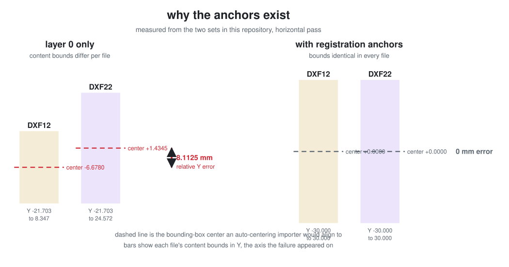

# Documentation

How the toolchain fits together, what the labels mean, and what the laser must be
told before a file is exposed. For the measurement history and why the design
ended up this way, see
[CALIBRATION_AND_SLIDING_NEST_NOTES.md](CALIBRATION_AND_SLIDING_NEST_NOTES.md).

## Contents

- [Scope and safety](#scope-and-safety)
- [Requirements](#requirements)
- [The labeling convention](#the-labeling-convention)
- [Pipeline](#pipeline)
- [Slicing an arbitrary pattern](#slicing-an-arbitrary-pattern)
- [Double exposure](#double-exposure)
- [Laser import settings](#laser-import-settings)
- [Jigs and printing](#jigs-and-printing)
- [Running the KLayout macros directly](#running-the-klayout-macros-directly)
- [Reference](#reference)

## Scope and safety

### What this repository is

Geometry generation and the fixtures that position a wafer. It produces DXF files
whose coordinates are correct with respect to one measured machine, and STLs for
jigs that index that wafer on a 1 inch table grid.

### What it is not

It specifies **no laser system and no process parameters**: no make or model, no
wavelength, no average or peak power, no laser class, no pulse energy, repetition
rate, scan speed, pass count, focus height, or assist gas. Nothing here has been
validated as a process. The only exposure statement in the whole repository is
geometric: cut features are `50 um` wide.

Consequently:

- **Laser eyewear must match your actual wavelength and power.** Generic safety
  glasses are not laser eyewear. UV is invisible, so there is no blink reflex to
  rely on. Work inside your facility's own laser safety controls, enclosure, and
  interlocks, under whatever authority governs that laser.
- **Silicon debris is a real hazard.** Laser-cutting silicon generates respirable
  particulate; fracturing a scored wafer throws sharp fragments. Use extraction
  appropriate to the material and contain the break.
- **"Low power" is deliberately undefined here** because it depends entirely on a
  laser this repository knows nothing about. Establish it empirically on
  sacrificial material, starting below anything you expect to mark.
- **The fracture workflow is an experiment, not a recipe.** Whether a scored wafer
  breaks cleanly depends on score depth, crystal orientation, thickness, coatings,
  and edge defects. Prove it on sacrificial wafers before trusting real material.

### Calibration is machine-specific

`LASER_ZERO = (96.190, 109.350) mm`, the nest offsets, and the field size were
measured by hand on one table with one printed jig, and are treated throughout as
authoritative *for that setup only*. On any other machine they are simply wrong.
Re-measure your own zero before cutting anything you care about, and treat the
numbers here as a worked example of the method rather than values to copy.

The history in
[CALIBRATION_AND_SLIDING_NEST_NOTES.md](CALIBRATION_AND_SLIDING_NEST_NOTES.md)
records one calibration that was already wrong once: an edge-derived field center
of `(100.172, 107.672)` was superseded by a directly measured `(96.190, 109.350)`,
a `1.678 mm` correction in Y.

A superseded splitter profile, `python/split_klayout_four_windows_old_jig_test.py`,
still ships beside the production one. It targets a jig that no longer exists and
will place geometry wrong on the current one. Its docstring says so; check which
profile you are running before you expose anything.

## Requirements

- Python 3.11+ and the standalone KLayout wheel, which is all `tools/` needs.
  Developed against `klayout` 0.30.9.
- Optionally the KLayout application, to run the macros in `python/` from its GUI
  or headless executable instead.
- Autodesk Fusion, only to regenerate the jig CAD and STLs. The scripts in
  `fusion/` use the Fusion API and cannot run outside it.

### Dependency licensing

Worth knowing before choosing a license for this repository:

- **KLayout is GPL-3.0-or-later.** Every script in `python/` and `tools/` imports
  its API (`pya`, or `klayout.db` from the wheel). If you distribute this code
  under a license of your own, look at how that interacts with the GPL before
  assuming a permissive license is available to you.
- **The Autodesk Fusion API is proprietary.** The scripts in `fusion/` import
  `adsk.core` and `adsk.fusion`, which exist only inside Fusion and are governed by
  Autodesk's terms. The `.manifest` files and `.vscode/launch.json` in each jig
  folder are Autodesk-generated add-in scaffolding.

## The labeling convention

This is the thing most likely to cause an expensive mistake.

Folder and job labels name the **jig station**, read like a matrix: the first
digit is the row from the table rear (`1` = top/rear, `2` = bottom/front) and the
second is the column from the table left (`1` = left, `2` = right).

Indexing the jig moves the wafer, not the laser. Both axes therefore invert, and
each station exposes the **diagonally opposite** wafer quadrant:

| Folder | Jig station | Engraved hole | Exposure center | Exposes |
| --- | --- | --- | ---: | --- |
| `DXF11` | top-left | `C4 R3` | `(+25.4, -25.4) mm` | wafer bottom-right |
| `DXF12` | top-right | `C6 R3` | `(-25.4, -25.4) mm` | wafer bottom-left |
| `DXF21` | bottom-left | `C4 R1` | `(+25.4, +25.4) mm` | wafer top-right |
| `DXF22` | bottom-right | `C6 R1` | `(-25.4, +25.4) mm` | wafer top-left |


The laser field is bolted to the table at laser zero. Only the wafer moves, so
sliding the jig left and rearward slides the exposed area right and forward. The
red circle is the one hole the plate engraves for this station.

Grid columns count from the table left and rows from the table front, both from
zero. The engraved hole is the outer front-right pin, the one to the right of the
wafer's primary flat. The eight-pin pattern is rigid, so seating that single pin
fixes the other seven; it always sits two grid spaces right of and two spaces
forward of the pin-pattern center.

Verify all of it from the table geometry rather than trusting this table:

```bash
python tools/pin_grid_layout.py
```

### The old scheme

Sets generated before 2026-08-08 label folders by **exposed wafer quadrant**,
where `DXF11` means the wafer's top-left. Converting between the schemes swaps
`11` and `22` and leaves `12` and `21` unchanged, name and contents both. Two of
four folders therefore look untouched while meaning something different, so
confirm against the jig station, never the digits alone.

The archived sets under `output/` were deliberately not renumbered, because the
recorded seam measurements name those folders.

## Pipeline

```
dxf/100mm_10x30mm_Masters/          python/generate_100mm_10x30mm_masters.py
  Horizontal_master.dxf                 50 um cuts on a 10 x 30 mm grid, clipped
  Vertical_master.dxf                   2 mm inside the edge and both flats
        |
        |  python/split_klayout_four_windows.py
        |  driven by tools/build_pin_grid_set.py
        v
output/DXFs/<set>/DXF11..DXF22/     four 52 mm jobs, each centered on (0,0)
  Horizontal.dxf  Vertical.dxf       1.2 mm total stitch overlap at each seam
                                     registration anchors at +/-26.000 mm
```

Horizontal and vertical cuts are separate files for the same jig position. Run
both without moving the jig or the wafer between them.

### Clip, then translate


The splitter intersects the master with one clip box per station, then translates
the result by the negative of that station's field center. Every output therefore
sits centered on `(0, 0)`, which is what the laser expects, and the four
registration anchors pin the content bounds to the same square in all of them.

### Partition mode and the seam


`partition` mode, the default, gives each quadrant a single owner so geometry is
cut once rather than twice, then extends each job `0.600 mm` past `X=0` and `Y=0`
so neighbours meet instead of leaving a gap. The zoom shows the only region where
two jobs deliberately overlap.

At the production settings `CLIP_MODE` makes no difference: because the field is
exactly `2 x 25.4 + 1.2 mm`, the fields overlap by precisely the stitch, so
`full_window` yields the same box as `partition` for all four stations. The
setting only begins to matter if the field is enlarged beyond that relation.

### Guarantees the splitter enforces

Three checks run on every build, so a square origin-centred window does not
depend on anyone remembering the relationship between the settings:

1. **The field relation.** `QUALIFIED_FIELD_SIZE_UM` must equal
   `2 x WINDOW_CENTER + STITCH_OVERLAP_UM`, and the two window centers must
   match. This is what makes each window both square and concentric with its
   field. Changing the stitch alone used to break it silently: at `0` the window
   lands `0.3 mm` off-centre, and at `4000` it becomes `53.4 mm` and reaches
   `1.4 mm` *outside* the qualified field. Both now stop the run.
2. **Every window is square.** Each clip box is checked to be square, equal to
   the qualified field, and symmetric about the origin after translation.
3. **Nothing is silently discarded.** Geometry outside all four windows is
   measured before clipping and stops the run, reporting the lost area and its
   bounds. A pattern reaching `+/-70 mm` loses `148.8 mm2`, `26.8%` of the cut
   geometry, and without this check produced four healthy-looking square files
   and a zero exit code. Pass `-rd allow_geometry_outside_fields=1` when clipping
   the pattern away really is intended.

The split log records all three, including the source and dropped areas.

### Field and stitch geometry

- Exposure/file bounds: `52.000 x 52.000 mm`.
- Field centers on the wafer: `X,Y = +/-25.400 mm`.
- Physical move between neighboring stations: `50.800 mm`, two 1 inch grid spaces.
- Total field overlap: `1.200 mm`, so each job extends `0.600 mm` across the
  nominal `X=0` and `Y=0` seams.
- Margin from the 52 mm exposure to every edge of the `78.485 mm` maximum usable
  optical field: `13.2425 mm`.
- Dice pitch `10.000 mm` in X, `30.000 mm` in Y. Cut width `50 um`.
- Edge bead / exclusion `2.000 mm`, applied inward from the circular edge and
  both flats, from the single `EDGE_BEAD_MM` variable in the master generator.

### Validation

`tools/validate_pin_grid_set.py` runs two independent checks and exits non-zero if
either fails:

1. **Reconstruction.** Each tile is translated back by its own field center and
   unioned. The result must XOR to exactly zero area against the layer-0 master,
   proving no cut geometry was lost, duplicated, or shifted by the split.
2. **Registration.** Every file must carry four anchors on
   `REGISTRATION_DO_NOT_EXPOSE` whose combined bounding box is exactly
   `+/-26.000 mm`.

## Laser import settings

Layer `0` is the only cutting layer.

The window is declared **twice**, on purpose, because the two mechanisms fail in
different situations:

- **`$EXTMIN` / `$EXTMAX` in the DXF header**, at exactly `+/-26.000 mm`, along
  with `$INSBASE` at the origin and `$LIMMIN` / `$LIMMAX`. KLayout writes a header
  containing only `$ACADVER`, which leaves every importer to infer the extent from
  whatever entities it finds. A declared extent needs no inference and does not
  depend on layer visibility.
- **Four `50 um` anchors on `REGISTRATION_DO_NOT_EXPOSE`**, whose combined bounds
  are the same `+/-26.000 mm`.

The anchors alone are not sufficient in principle: you are told to set that layer
to no marking, and an importer that computes extents from marking layers only
would ignore them. Measured on a deliberately sparse pattern, layer 0 by itself
gives boxes of `3.000 x 3.000 mm` at four unrelated centres, and two files with no
layer-0 geometry at all — while all four report `52.000 x 52.000 mm` centred on
the origin once the anchors are counted. That gap is why the header extents exist.

`tools/validate_pin_grid_set.py` checks both, and fails if either is missing or
wrong.

**Set `REGISTRATION_DO_NOT_EXPOSE` to no marking / zero power. Never expose it.
Never use fit-to-field scaling. Import at the drawing origin.**

This is not theoretical. A full-wafer run displaced one horizontal pass by about
`8 mm` because the importer auto-centered each file on its content bounds, and one
file's bounds were skewed by the centered alignment marker. The splitter math was
correct; the placement was not.



Those numbers are measured from the two sets in this repository, not illustrative.
With cutting geometry alone, `DXF12` and `DXF22` of the failed set have
bounding-box centers `8.1125 mm` apart in Y, which is what landed on the wafer.
With the anchors, every file's bounds are exactly `+/-30.000 mm` in that set and
`+/-26.000 mm` in the current one, so per-file centering becomes geometrically
harmless. Importing at the origin is still preferred.

If your importer reliably preserves the drawing origin, the anchors can be
disabled with `-rd add_registration_envelope=0`.

## Jigs and printing

| Script | Jig |
| --- | --- |
| [`fusion/FusionPinGridJig`](fusion/FusionPinGridJig) | Four-position eight-pin grid jig. Current. |
| [`fusion/FusionPinGridCenterJig`](fusion/FusionPinGridCenterJig) | Same plate, positioned for a single centered field. |
| [`fusion/FusionCenterPassJig`](fusion/FusionCenterPassJig) | Earlier single centered-pass jig, table-edge datums. |
| [`fusion/FusionSingleJig`](fusion/FusionSingleJig) | Earlier single-position indexer. |

The two pin-grid jigs are the same physical plate; only the engraving and which
table holes the pins engage differ. Each plate carries three engravings,
`0.500 mm` deep: the station map at top-left, giving one hole per station;
`C0=LEFT R0=FRONT` at front-left, so the counting convention survives at the
machine; and `ALIGNMENT PIN` at front-right, naming the outer pin nearest that
corner, which is the pin every engraved coordinate refers to.

To regenerate a jig: open Fusion, press **Shift+S**, on the Scripts tab click
**+** and select the script's folder, then Run. Each script writes its `.f3d` and
`.step` beside itself and a high-quality binary `.stl` into
[`fusion/print-files`](fusion/print-files).

Sliceable STLs are already committed. Print the pin-grid jigs with the 2 mm wafer
platform upward; the downward pins need support blockers everywhere except beneath
the pins. Verify pin fit on a coupon first: nominal radial clearance is `0.085 mm`
against a measured `4.870 mm` thread minor diameter, and PLA shrinkage and thread
crests both matter at that scale.

## Slicing an arbitrary pattern

The production path (`tools/build_pin_grid_set.py`) is wired to the 100 mm masters.
To slice something else, pick which layer holds the cutlines and what width they
should be.

### Desktop window

```bash
python tools/slicer_gui.py
```

Choose a file and it reads the layers out of it, showing shape counts, drawn area,
and the existing path widths for each. It preselects the layer with the most drawn
area, which is the cutline layer in every file this toolchain has seen, but any
layer can be chosen by name or by number.

Width has two modes. **Cap** narrows only paths wider than your value and leaves
thinner ones alone; **force** sets every path to exactly your value, widening as
well as narrowing.

One thing the window tells you that is easy to miss: **width only applies to native
paths.** A filled polygon carries its size as geometry, so if the chosen layer is
polygons the width control cannot change anything, and the window says so rather
than letting you believe a new width took effect. The generated 100 mm masters are
polygons for exactly this reason.

The field size, window centers, and stitch overlap are shown read-only, because the
relation the splitter enforces locks them together.

### Command line

The same options without the window:

```bash
python tools/run_splitter.py --input wafer.dxf --list-layers
```

```bash
python tools/run_splitter.py --input wafer.dxf --layer CUT --cut-width 40 --width-mode force --output jobs/
```

Add `--no-anchors`, `--no-header-extents`, `--allow-outside`, `--global-x/--global-y`,
`--clip-mode`, `--stitch`, or `--extension` as needed. This is also the supported way
to drive the splitter from plain Python, since the macro itself reads overrides from
`globals()` and parses no arguments of its own.

## Double exposure

Two places in the current recipe expose the same area twice. Measured on the
production set:

| source | area at 2x dose | share of exposed area |
| --- | ---: | ---: |
| grid crossings, where `Horizontal.dxf` meets `Vertical.dxf` | `0.0700 mm2` in 28 spots of `50 x 50 um` | `0.14%` |
| seam overlap, where two neighbouring jobs both reach past `X=0` / `Y=0` | `1.3225 mm2` | `2.69%` |
| total | `1.3925 mm2` of `49.1333 mm2` | `2.83%` |

The **seam overlap is deliberate** — it is the `1.2 mm` stitch that stops a gap
appearing at the seam — and it is by far the larger contributor. The **crossings are
incidental**: they land exactly on the corners of every die, which is where chipping
starts, so if corner quality matters they are worth removing.

Removing them needs no change to what gets cut. Emitting `Vertical - Horizontal`
instead of `Vertical` leaves the union bit-identical (verified: XOR area zero) while
dropping crossing overlap to zero, at the cost of `0.0700 mm2` less vertical
geometry. Not implemented; raise it if you want it.

## Running the KLayout macros directly

The macros in `python/` read their overrides out of `globals()`, which is
KLayout's `-rd` mechanism. They have no `argv` parsing, so plain
`python script.py` cannot be parameterized; that is what `tools/` is for.

From the repository root, with KLayout's headless executable:

```powershell
& "$env:APPDATA\KLayout\klayout_vo_app.exe" -zz -rx -r .\python\split_klayout_four_windows.py -rd "input=.\dxf\100mm_10x30mm_Masters\100mm_wafer_10x30mm_Horizontal_master.dxf" -rd "output_dir=.\output\four_window_output"
```

Or from the KLayout GUI with **File > Run Script**, after editing `INPUT_FILE` and
`OUTPUT_DIR` at the top of the script.

## Provenance of the committed files

Not everything checked in is reproducible from the current scripts. What is what:

- `dxf/100mm_10x30mm_Masters/` is generated. Re-running
  `python/generate_100mm_10x30mm_masters.py` with
  `-rd output_dir=dxf/100mm_10x30mm_Masters` reproduces both DXFs byte-for-byte.
- `dxf/080526_HorizDicev2.dxf` and `dxf/080526_VertDicev2.dxf` are the earlier
  hand-drawn reference drawings the toolchain was first developed against. They are
  inputs, not generated, and no script produces them.
- `python/examples/` was produced by earlier revisions of the splitter and the
  center-pass script, at a 60 mm field with zero stitch overlap and an older
  manifest schema. It is illustrative output only: the current scripts will not
  reproduce those files, and their `validation_report.txt` metrics come from a
  checker that no longer exists in this repository. `tools/validate_pin_grid_set.py`
  is the current one.
- `fusion/FusionSingleJig` builds against the **corrected** measured zero cross:
  it computes `EDGE_DERIVED_CENTER_Y` for reference but sets
  `FIELD_CENTER_Y = MEASURED_ZERO_CROSS_Y = 109.350`. It is superseded by the
  pin-grid jigs because it indexes off table edges rather than the hole grid, not
  because its center is wrong.
- `fusion/single_jig_wafer_indexer.scad` is an early OpenSCAD sketch of that same
  single-position indexer, kept for reference. It is not generated by anything here
  and is not the source of any committed STL; the Fusion script is authoritative.

## Figures

Every figure on this page is generated, not drawn:

```bash
python tools/make_figures.py
```

Cut geometry is read out of the master DXFs, station geometry comes from
`tools/pin_grid_layout.py`, and the registration figure reads the real content
bounds of the two shipped sets. Regenerate after changing any of those and the
figures follow. Cut features are `50 um` wide on a `100 mm` wafer, so they are
stroked to stay visible; everything else is to scale except the seam zoom and the
oversized anchor squares, both of which are labelled as such.

## Reference

- [Four-window splitter](python/KLayoutFourWindowSplitter_README.md) — every setting and the full window mapping
- [Center-pass workflow](python/CenterPassWorkflow_README.md) — the single centered scoring job
- [Generated job sets](output/README.md) — what each set is and which labeling it uses
- [Pin-grid jig](fusion/FusionPinGridJig/README.md) — dimensions, tolerances, hole map
- [Center-field jig](fusion/FusionPinGridCenterJig/README.md) — the centered variant
