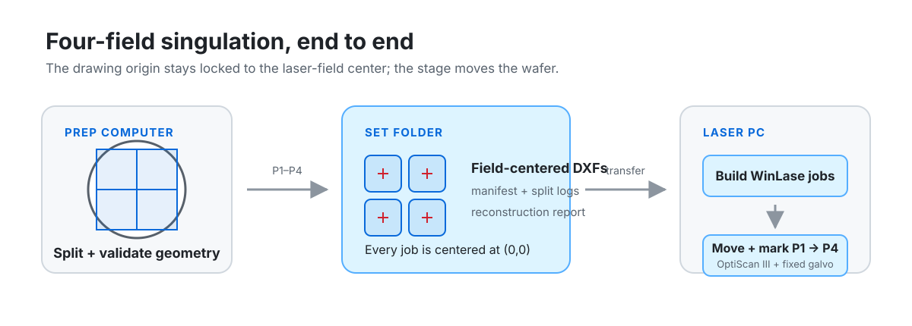

# UV Laser Singulation

Geometry preparation, stage control, and WinLase automation for four-field
singulation of a 100 mm silicon wafer on a UV galvo system.



The laser field remains fixed. A Prior OptiScan III stage moves an edge-datum
wafer jig through four taught positions (`P1`–`P4`), while each DXF is translated
so its field center is at the drawing origin. The result is a repeatable pipeline
from wafer-scale cut geometry to four field-centered WinLase jobs.

> [!CAUTION]
> This repository contains machine-specific geometry, calibration assumptions,
> motion limits, and laser-profile gates. It is not a transferable process recipe.
> UV radiation is invisible; use wavelength- and power-rated eyewear, the
> facility enclosure and interlocks, appropriate extraction for silicon debris,
> and the hardware emergency stop. Prove motion, placement, focus, and process
> settings on sacrificial material before an armed run.

## What the repository does

1. Generates or accepts wafer-centered DXF/GDS/OAS cut geometry.
2. Optionally separates a combined cut layer into horizontal and vertical passes.
3. Clips the design into four station jobs, translates each job to field origin,
   and writes manifests and build logs.
4. Reconstructs the masters from the emitted jobs and checks field placement.
5. Builds one WinLase job per station and runs the `P1 -> P2 -> P3 -> P4`
   stage/mark sequence.
6. Provides Fusion generators and exports for the current edge-datum wafer jig.

### Current geometry defaults

| Setting | Value |
| --- | ---: |
| Wafer | 100 mm |
| Qualified galvo field | 54 × 54 mm |
| Usable central field | 60 × 60 mm |
| Field centers in wafer coordinates | X,Y = ±25.4 mm |
| Split mode | `partition` |
| Total stitch overlap | 400 µm |
| Maximum cut-path width | 50 µm |
| Global placement offset | 0 µm, X and Y |

The stitch and field settings above are the defaults in
[`slicing/split_klayout.py`](slicing/split_klayout.py). They can be overridden by
the build tools, and every emitted set records the effective values.

## Requirements

| Environment | Requirements |
| --- | --- |
| Design/prep PC | Python 3.11+ and `klayout`; `PySide6` for the desktop slicer |
| Laser PC | Windows, Python 3.8+, WinLase Professional, `pywin32`, and either `pyserial` or the pywin32 serial backend |
| Jig regeneration | Autodesk Fusion with its Python API |

Install the prep dependencies:

```bash
pip install klayout PySide6
```

The command-line builders and validators need only `klayout`.

## Quick start: prepare and validate a set

From the repository root:

```bash
python slicing/build_pin_grid_set.py
python slicing/validate_pin_grid_set.py
```

The default build consumes the paired masters in
`dxf/100mm_10x30mm_Masters/` and writes a four-station set under
`output/DXFs/`. Each station folder contains one DXF per pass angle; the set
also contains a position manifest, split logs, and validation output.

For a design whose cut orientations share one layer:

```bash
python slicing/build_pin_grid_set.py \
  --combined wafer.gds \
  --cut-layer 7 \
  --edge-bead 2
```

Useful build controls include `--rotation`, `--jig-flat`, `--cut-width`,
`--width-mode`, `--stitch`, per-station `--offset`, independent X/Y window
centers, and `--clip-mode`. See the complete interface with:

```bash
python slicing/build_pin_grid_set.py --help
```

### Interactive slicer

```bash
python slicing/slicer_app.py
```

The PySide6/QML app previews the wafer, source layers, four-window or center-pass
clipping, cut width, offsets, and edge bead before writing the set. The same
workflow is available from the CLI wrapper:

```bash
python slicing/run_splitter.py --input wafer.dxf --list-layers
```

## Run on the laser PC

Transfer the validated set to the offline machine, then work through dry-run and
pre-flight modes before arming:

```bash
# Parse the set without WinLase, then verify the first job in memory.
python laser-pc/winlase_build_jobs.py output/DXFs/<set> --dry-run
python laser-pc/winlase_build_jobs.py output/DXFs/<set> --verify

# Build all four .wlj files. Close the WinLase GUI first.
python laser-pc/winlase_build_jobs.py output/DXFs/<set>

# Teach P1-P4 once for the current jig/datum, then inspect the run plan.
python laser-pc/optiscan.py jog
python laser-pc/dice_wafer.py output/DXFs/<set> --list

# Real stage motion, simulated marking.
python laser-pc/dice_wafer.py output/DXFs/<set>

# Live laser run.
python laser-pc/dice_wafer.py output/DXFs/<set> --arm
```

`dice_wafer.py` defaults to simulated marking but still moves the real stage. An
armed run adds typed confirmation and a countdown, checks all taught positions
against the current asymmetric stage envelope, verifies the laser profile before
any motion and again at mark time, and supports controlled stop flags. A controlled
stop is not an emergency stop.

The current job builder writes a 100 mm/s mark speed and requires the configured
WinLase profile to read back at 100% power and 30 kHz. The default run count is 175
passes unless overridden by `laser-pc/dice_passes.csv` or `--passes`. These are
rig-specific values recorded by the code, not recommendations for another laser.

For the Tk launcher, double-click [`laser-pc/run_ui.bat`](laser-pc/run_ui.bat).
Detailed machine setup and failure handling are in
[`laser-pc/WINLASE_AUTOMATION_README.md`](laser-pc/WINLASE_AUTOMATION_README.md).

## Coordinate contract

- Source geometry is wafer-centered.
- `P1`–`P4` identify stage/jig stations, not wafer quadrants.
- Each output is translated so its laser-field center lands at `(0, 0)`.
- WinLase auto-centering and fit-to-field scaling must remain off.
- The current edge-datum jig stays seated; the stage performs the indexing.
- Coarse placement lives in the taught stage positions. Splitter global and
  per-station offsets default to zero.

The validator translates every station job back into wafer coordinates, unions the
result, and requires zero XOR area against the source master. It also checks that
the emitted geometry fits the usable field around the origin and exits non-zero on
failure.

## Repository layout

| Path | Purpose |
| --- | --- |
| [`slicing/`](slicing) | KLayout generators, splitters, validators, CLI tools, and PySide6/QML preview |
| [`laser-pc/`](laser-pc) | OptiScan driver, WinLase job builder, sequenced dicer, and Tk launcher |
| [`fusion/`](fusion) | Edge-datum jig generators plus CAD/STL exports |
| [`dxf/`](dxf) | Source drawings and generated wafer masters |
| [`output/`](output) | Generated and validated job sets |
| [`docs/figures/`](docs/figures) | Documentation figures |

## Documentation

- [`DOCUMENTATION.md`](DOCUMENTATION.md) — coordinate frames, labeling,
  splitter guarantees, import settings, and jig details
- [`OPERATING_PROCEDURE.md`](OPERATING_PROCEDURE.md) — operator sequence
- [`CALIBRATION_AND_SLIDING_NEST_NOTES.md`](CALIBRATION_AND_SLIDING_NEST_NOTES.md)
  — measurement history and design decisions
- [`slicing/KLayoutFourWindowSplitter_README.md`](slicing/KLayoutFourWindowSplitter_README.md)
  — splitter configuration and output contract
- [`slicing/CenterPassWorkflow_README.md`](slicing/CenterPassWorkflow_README.md)
  — centered scoring workflow

## License

No license is granted. The repository is published for reference; all rights are
reserved.

