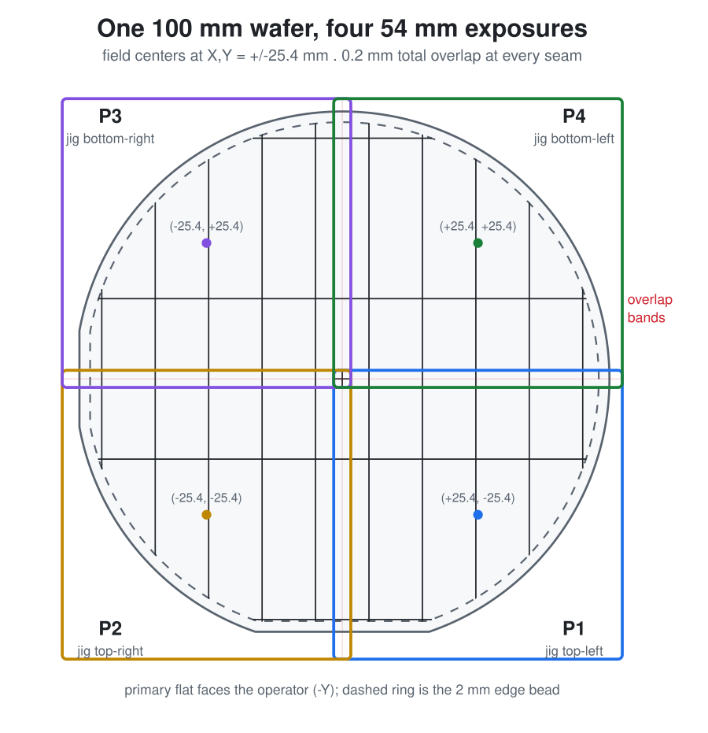

# UV-Laser-Singulation

Singulate 100 mm silicon wafers on a UV laser whose exposure field is smaller than
the wafer. Generates the dicing geometry, splits it into four laser-sized jobs,
and generates the 3D-printed jigs that index the wafer between them.

Geometry is built with [KLayout](https://www.klayout.de/)'s Python API. The jigs
are built by Autodesk Fusion scripts from the same measured table dimensions.



> **This repository is geometry, not a process.** It specifies no laser, no
> wavelength, no power, no pulse parameters and no exposure recipe, and it has not
> been validated as a process. Every calibration number in it was measured by hand
> on one specific machine and one printed jig, and will be wrong for yours.
>
> Eyewear must be rated for your laser's actual wavelength and power — generic
> safety glasses are not laser eyewear, and UV is invisible. Follow your own
> facility's laser safety controls and interlocks. Cutting and fracturing silicon
> throws respirable dust and sharp fragments: contain them, and do not improvise
> the fracture step on anything you have not first proven on a sacrificial wafer.
> See [DOCUMENTATION.md](DOCUMENTATION.md#scope-and-safety) for what is and is not
> covered here.

## Install

```bash
pip install klayout
```

## Use

```bash
python tools/build_pin_grid_set.py
```

```bash
python tools/validate_pin_grid_set.py
```

The build writes four labeled folders of exposure files. The validator
reconstructs each master from those tiles and requires zero XOR area against it,
then checks every registration bounding box and declared window. It exits non-zero
on failure.

To slice a pattern of your own, pick the cutline layer and width in a window and
watch the four jobs update over the wafer:

```bash
python tools/slicer_app.py
```

The window needs PySide6 in a venv at a short path; see
[DOCUMENTATION.md](DOCUMENTATION.md#desktop-window) for why.

or on the command line with `python tools/run_splitter.py --input wafer.dxf
--list-layers` to see the layers first.

## Layout

| Path | Contents |
| --- | --- |
| [`python/`](python) | KLayout macros: master generation, the four-window splitter, the center pass |
| [`tools/`](tools) | Build and validate a production set; the shared jig-station table |
| [`fusion/`](fusion) | Fusion scripts that generate each jig, plus exported CAD and STLs |
| [`dxf/`](dxf) | Input drawings and the generated 100 mm masters |
| [`output/`](output) | Generated, validated laser job sets |
| [`docs/figures/`](docs/figures) | SVG figures, generated by `tools/make_figures.py` |

## Documentation

- [DOCUMENTATION.md](DOCUMENTATION.md) — labeling convention, pipeline, laser import settings, jigs and printing
- [CALIBRATION_AND_SLIDING_NEST_NOTES.md](CALIBRATION_AND_SLIDING_NEST_NOTES.md) — measurements, failures, and design decisions

## License

None yet, which means all rights reserved: published for reference only. Add a
LICENSE file if you want others to be able to build on it.
